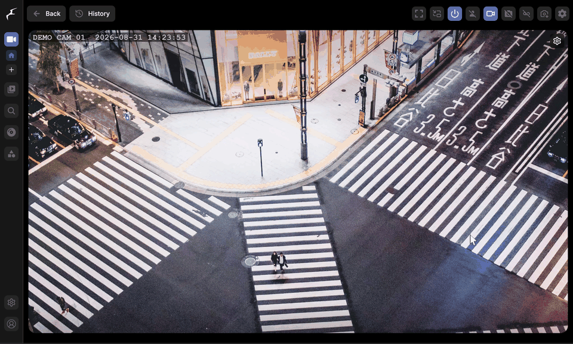

# frigate-abr


Adaptive bitrate streaming overlay for [Frigate NVR](https://github.com/blakeblackshear/frigate). Adds a quality selector to live view and recordings, so remote viewing works on a connection that cannot carry the full camera bitrate. Lower tiers are transcoded only while someone is watching, so nothing extra is stored. Drop-in Docker image, no Frigate source modifications.

Key capabilities:

- A quality selector on every video player: Original, 1080p, 720p, 480p, or [any tiers you define](#quality-tiers).
- [Live view](#how-it-works): lower-resolution variants registered in go2rtc, transcoded only while a viewer is connected.
- [Recordings](#hardware-acceleration): 10-second segments transcoded on demand with GPU acceleration, cached after first play.



<sub>Demo instance with a synthetic camera feed rendered from a CC0 photo. Switching to 480p cuts the stream from 8.6 to 0.6 Mbit/s.</sub>

## Installation

**1. Swap the image** in your `docker-compose.yml` (or Portainer stack). Everything else stays the same:

```yaml
services:
  frigate:
    image: ghcr.io/007hacky007/frigate-abr:latest   # was: ghcr.io/blakeblackshear/frigate:stable
```

NVIDIA: `latest-tensorrt`. AMD: `latest-rocm`. See [Images and tags](#images-and-tags).

**2. Restart:** `docker compose up -d`

**3. Open Frigate** and click the gear icon on any player.

That is the whole install. The image is Frigate `0.17.2` with the overlay pre-installed, hardware acceleration is read from your Frigate config, and the defaults (1080p/720p/480p, 10 GB cache) fit most setups. To change the tiers, mount your own config:

```yaml
    volumes:
      - ./config-abr.yml:/opt/frigate-abr/config.yml:ro
```

```yaml
# config-abr.yml
enabled: true
tiers:
  - name: "720p"
    width: 1280
    height: 720
    bitrate: "1200k"
  - name: "480p"
    width: 854
    height: 480
    bitrate: "500k"
```

Every other setting has a default; see the [configuration reference](#configuration-reference).

## Why this exists

Frigate 0.19 adds its own quality switching for recordings ([PR #24009](https://github.com/blakeblackshear/frigate/pull/24009)): a second, lower-quality camera stream is recorded around the clock next to the main one, and the History player switches between the two. Asked whether on-demand transcoding could follow, the maintainers answered that there are no plans for it ([#18497](https://github.com/blakeblackshear/frigate/issues/18497#issuecomment-5425096912)) and that they point users who want a transcoded option here.

frigate-abr transcodes the original recording on demand instead. Advantages over the built-in approach:

- **No extra disk space.** Nothing is recorded twice. Segments are transcoded when someone presses play and kept in a bounded cache (10 GB, 24 h by default), instead of a second stream written to disk around the clock.
- **Custom tiers, independent of the camera.** Frigate's Low quality is whatever sub stream the camera provides, and many cameras (Reolink, for one) offer a single 480p sub stream. frigate-abr tiers are defined in config, as many as you want, from any camera: 1080p, 720p and 480p by default, 360p for satellite links.
- **Changes apply instantly, to all footage.** Tiers are cut from the original recording, so adding or adjusting a tier covers everything already on disk. A recorded sub stream exists only for footage captured after you set it up, at the settings of that time.
- **Plays in every browser.** Every tier is H.264, which every browser decodes. A recorded sub stream plays only if the browser can decode its codec, which rules out HEVC sub streams on browsers without HEVC support.

The built-in feature is the better fit if you want months of low-quality history after the originals expire, or your host has no transcoder at all.

<details>
<summary>Side-by-side comparison with Frigate 0.19</summary>

| | frigate-abr | Frigate 0.19 `record_sub` |
|---|---|---|
| Disk space | None extra; segments are transcoded on play and kept in a bounded cache (10 GB, 24 h by default) | Second stream recorded around the clock, with its own retention |
| Quality levels | Any number, defined in config, independent of the camera (defaults 1080p/720p/480p, add 360p for satellite) | Two: Original and Low. Low is the camera's sub stream, on many cameras a single 480p stream |
| Changing tiers | Applies instantly to all footage on disk | Only footage recorded after the change; older recordings keep the sub stream recorded at the time, or none |
| Browser support | Every tier is H.264, which every browser decodes | Low plays only if the browser decodes the sub stream's codec; an HEVC sub stream needs HEVC support |
| Cameras without a usable sub stream | Transcode runs only while someone watches | Continuous go2rtc transcode of the main stream, one encode per camera |
| Switching qualities | Tiers share source, audio and codec; the playlist is one continuous timeline | Streams with different codecs or audio parameters get a decoder reset at each switch; a sub stream without audio makes mixed ranges play silent |
| Live view | Tiers registered in go2rtc automatically, capped at the tier bitrate | Not part of #24009; sub streams go in `live.streams` by hand |
| Hardware needed | A transcoder: Intel QSV/VAAPI, NVENC, ROCm, or CPU at low tiers (a Pi 5 runs one software transcode) | None beyond the camera's encoder |
| History after originals expire | None | As long as the low stream's retention allows |
| Frigate version | 0.17.2 today, image swap only | 0.19 |

</details>

## Quality tiers

| Tier | Resolution | Bitrate | Use case |
|------|-----------|---------|----------|
| Original | Native (e.g. 4K) | Passthrough | LAN / fast connections |
| 1080p | 1920x1080 | 2500k | Broadband |
| 720p | 1280x720 | 1200k | Mobile / moderate |
| 480p | 854x480 | 500k | Slow connections |

These are conservative defaults tuned for security camera footage (mostly static scenes), assuming cameras around 20-25 fps: each tier works out to roughly 0.06 bits per pixel, with about a 2x step between tiers. For 30 fps cameras nudge the bitrates up (~3000k for 1080p); for 10-15 fps streams you can trim them by about a third. Configurable in `config.yml`.

For very slow uplinks (satellite, weak cellular), add a lower tier instead of squeezing the existing ones:

```yaml
  - name: "360p"
    width: 640
    height: 360
    bitrate: "250k"
```

### Which tier to expect where

Wire rate is the tier's video bitrate plus the camera's audio and mux overhead
(typically +100-150 kbit/s). Pick the highest tier your remote uplink sustains
with ~1.5x headroom.

| Tier | ~Wire rate | Works on | What to expect |
|------|-----------|----------|----------------|
| Original | camera bitrate | LAN, fast uplinks | native quality |
| 1080p @ 2500k | ~2.7 Mbit/s | uplink >= 4 Mbit/s | crisp static scenes, mild softening during heavy motion |
| 720p @ 1200k | ~1.4 Mbit/s | uplink >= 2 Mbit/s | good on phone/tablet screens, near-field detail preserved |
| 480p @ 500k | ~0.65 Mbit/s | uplink >= 1 Mbit/s | overview quality: see what happened, not fine detail |
| 360p @ 250k (optional) | ~0.4 Mbit/s | satellite, weak cellular | motion and presence visible, faces and plates are not |

Halving these bitrates roughly doubles the reach of each tier at a visible
quality cost, mostly during motion; since live streams started honoring the
configured bitrate, lean overrides that previously only affected recordings
now shape live quality too.

### Live bitrate enforcement

Live variants cap the video track at the tier's bitrate (applied to go2rtc's
encoder via `#raw=-b:v ...`). Two things to know:

- **Audio is copied, not capped.** A tier streams its video bitrate plus the
  camera's original audio, typically a negligible 30-64 kbit/s AAC.
- **Invalid bitrate values are never injected.** Anything not matching a plain
  ffmpeg bitrate (`300k`, `2.5M`, `800000`) is skipped with a warning in the
  Docker logs and the variant runs without a cap, like older releases did.

Set `live_bitrate: false` in `config.yml` to disable enforcement entirely
(the escape hatch if a future go2rtc changes how `#raw` args are placed).

go2rtc forgets API-registered streams when it restarts (a crash, or Frigate
rewriting its config), so the sidecar re-checks every `live_reconcile_interval`
seconds and re-registers missing variants, which also picks up cameras added
after startup.

## Images and tags

Images are built for all Frigate variants:

| Tag | Base image | Use case |
|-----|-----------|----------|
| `latest` | `frigate:0.17.2` | Standard x86_64 (Intel/AMD) |
| `latest-tensorrt` | `frigate:0.17.2-tensorrt` | NVIDIA GPU with TensorRT |
| `latest-rocm` | `frigate:0.17.2-rocm` | AMD GPU with ROCm |

Pinned version tags are also available (e.g. `frigate-0.17.2-tensorrt`).

Every release image is built transparently by [GitHub Actions](.github/workflows/build.yml) from the public, auditable code on `master` and cryptographically signed at build time - verify it yourself with `gh attestation verify oci://ghcr.io/007hacky007/frigate-abr:latest --owner 007hacky007`.

To build locally for a specific variant:

```bash
git clone https://github.com/007hacky007/frigate-abr.git
cd frigate-abr

# Standard
docker build -t frigate-abr .

# NVIDIA TensorRT
docker build --build-arg FRIGATE_VERSION=0.17.2-tensorrt -t frigate-abr:tensorrt .

# Rockchip
docker build --build-arg FRIGATE_VERSION=0.17.2-rk -t frigate-abr:rk .
```

## Hardware acceleration

The sidecar auto-detects your hwaccel preset from Frigate's config. Override in `config.yml` if needed:

| Hardware | Value |
|----------|-------|
| NVIDIA | `preset-nvidia` |
| Intel iGPU (VAAPI) | `preset-vaapi` |
| Intel iGPU (QSV) | `preset-intel-qsv-h264` |
| AMD (VAAPI) | `preset-vaapi` |
| Rockchip | `preset-rkmpp` |
| Raspberry Pi | `preset-rpi-64-h264` |
| CPU only | `default` |

For Intel GPUs, VOD transcoding uses QSV (decode + scale + encode entirely on GPU). Live transcoding is handled by go2rtc.

## Configuration reference

`config.yml`:

```yaml
enabled: true

tiers:
  - name: "1080p"
    width: 1920
    height: 1080
    bitrate: "2500k"
  - name: "720p"
    width: 1280
    height: 720
    bitrate: "1200k"
  - name: "480p"
    width: 854
    height: 480
    bitrate: "500k"

cache:
  path: /tmp/cache/abr
  max_size_gb: 10.0    # LRU eviction when exceeded
  ttl_hours: 24         # Cached segments expire after this

max_concurrent_transcodes: 2   # Limits simultaneous GPU transcodes

live_bitrate: true             # Cap live variants at the tier bitrate (video only)
live_reconcile_interval: 30    # Seconds between go2rtc variant re-checks (0 = off)

# Auto-detected from Frigate config. Override if needed:
# hwaccel: preset-nvidia
# gpu: 0
```

## Verify

```bash
# Check logs for successful startup
docker compose logs frigate | grep "\[ABR\]"

# Check sidecar health (should show version and commit)
curl http://localhost:5000/abr/health

# Check transcoding works
curl http://localhost:5000/abr/debug/transcode?camera=YOUR_CAMERA&quality=480p
```

## API endpoints

| Endpoint | Description |
|----------|-------------|
| `GET /abr/health` | Health check with version/commit |
| `GET /abr/config` | Returns tiers, cache stats, enabled state |
| `GET /abr/stats` | Active transcodes, cache size, hwaccel info |
| `GET /abr/debug/transcode` | Test single segment transcode with diagnostics |
| `POST /abr/live/setup` | Manually re-register go2rtc stream variants |

## How it works

1. **S6 oneshot** (`abr-patch`) patches `nginx.conf` before nginx starts - adds upstream, location blocks, and `sub_filter` for JS injection.
2. **S6 longrun** (`abr-sidecar`) runs a FastAPI service that registers go2rtc stream variants, generates HLS playlists, transcodes segments on-demand, and manages the cache.
3. **Frontend overlay** (`inject.js`) intercepts XHR/WebSocket requests to rewrite URLs based on the selected quality.

## Troubleshooting

| Symptom | Fix |
|---------|-----|
| No gear icon on video players | Check `docker compose logs frigate \| grep ABR` for patch errors. |
| Grey/black screen on ABR quality (live) | **Firefox autoplay restriction.** Click the lock icon in address bar -> Permissions -> Autoplay -> Allow Audio and Video. Chrome works without this. |
| Transcoding fails | Run `curl localhost:5000/abr/debug/transcode?camera=YOUR_CAMERA&quality=480p` and check `ffmpeg_exit_code` and `ffmpeg_stderr`. |
| Cache growing too large | Lower `cache.max_size_gb` or `cache.ttl_hours` in `config.yml`. |

## Frigate update compatibility

The overlay does not modify any Frigate source files. On Frigate update, the nginx patch re-applies automatically (idempotent). If Frigate changes `nginx.conf` structure significantly, the sed patterns in `abr-patch/run` may need updating - the patch logs clearly when it fails.

## FAQ

### Why not use nginx-vod-module for recording ABR?

I tried this first. Frigate already uses nginx-vod-module for HLS playback, so it seemed natural to route ABR requests through it with a different upstream. Two problems killed the approach:

1. **`vod_upstream_location` can't be overridden at location level.** I added a `/vod_abr/` location with `vod_upstream_location /abr;` pointing to the sidecar, but nginx-vod-module ignored it and kept using the server-level `vod_upstream_location /api` (Frigate's original API). Both `/vod_abr/` and `/vod/` returned identical 3840x2160 HEVC content.

2. **nginx-vod-module needs the entire manifest upfront.** It makes a single subrequest to get a JSON manifest with ALL clip paths, then generates the HLS playlist from that. The sidecar had to transcode ALL 300+ segments before returning the manifest. A 1-hour recording would take 30+ minutes to transcode upfront, and the subrequest would time out long before that.

The solution: bypass nginx-vod-module entirely for ABR. The sidecar generates its own m3u8 playlist and serves MPEG-TS segments on-demand. hls.js requests them one at a time, each transcodes in ~1-2 seconds with QSV, and they're cached after first play. Cached segments are transcoded with timestamps starting at zero and shifted to their playlist position at serve time (a stream-copy remux, no re-encode), so the playlist is one continuous timeline with no per-segment discontinuities and a cached segment stays valid in every playlist it appears in.

### Why does the VAAPI preset use QSV internally?

VAAPI's `scale_vaapi` filter fails with "Cannot allocate memory" when Frigate is simultaneously using the GPU for object detection. The GPU runs out of surface memory for a second decode+scale+encode pipeline. QSV (Intel Quick Sync) uses a different memory management model (libmfx/oneVPL) and doesn't have this contention issue, even on the same Intel GPU. So the `preset-vaapi` template maps to QSV decode + vpp_qsv scale + h264_qsv encode for VOD transcoding. Live transcoding is handled by go2rtc separately.

### Why does quality switching reload the page?

Frigate's MSEPlayer and WebRTCPlayer don't auto-reconnect when WebSockets are closed externally. Their internal state machines have conditions that prevent reconnection. I tried faking visibility changes and closing sockets directly, but the players either ignored it or entered long error-recovery loops. A page reload is the only reliable way to switch quality, and since the setting is stored in localStorage, the new page load picks it up immediately.

## License

MIT
